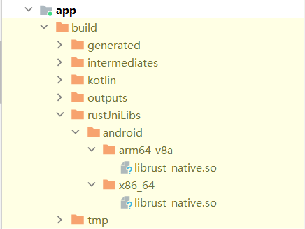

# Android项目引入Rust进行JNI开发

## 添加Gradle依赖

### 根目录build.gradle.kst文件中添加

```kotlin
plugins {
    ...
    id("org.mozilla.rust-android-gradle.rust-android") version "0.9.4" apply false
}
```

### app中引入

```kotlin
plugins {
    id("org.mozilla.rust-android-gradle.rust-android")
    ...
}
```

## 创建rust项目

这里位置是可选的，主要是创建后位置需要配置正确，我这里模仿`c++`，在java同层级创建rust文件夹，然后在rust目录下运行命令

```bash
cargo new rust-native
```

然后在app的`build.gralde.kts`文件的最外层添加

```kotlin
cargo {
    module = "src/main/rust/rust-native" // Rust 工程路径
    libname = "rust_native" // 编译后的so名字
    targets = listOf("x86_64", "arm64") // 目标CPU架构
//  profile = "release"
    profile = "debug"
}

tasks.configureEach(object : Action<Task> {
    override fun execute(task: Task) {
        if ((task.name == "javaPreCompileDebug" || task.name == "javaPreCompileRelease")) {
            task.setDependsOn(listOf("cargoBuildArm64", "cargoBuildX86_64"))
        }
    }
})
```

需要注意，生成的so文件中横线会转化为下划线，所以这里的`libname`要写`rust_native`，然后model为相对位置

## 创建jni方法

### 添加toml依赖

在rust的toml文件中增加

```toml
[dependencies]
jni = "0.21.1"

[lib]
crate_type = ["rlib", "dylib"]

[features]
default = ["foo"]
foo = []
bar = []
```

### rust jni实现

在rust项目的src目录下创建lib文件，lib文件会编译为so，然后实现一个简单的native方法，类似原始的`c++`项目，返回一个字符串

```rust
extern crate jni;

use jni::JNIEnv;
use jni::objects::{JClass, JString};

#[no_mangle]
pub extern "C" fn Java_com_jiangker_rust_1jni_RustLib_stringFromJNI<'a>(
    env: JNIEnv<'a>,
    _class: JClass<'a>,
) -> JString<'a> {
    return env.new_string("Rust").unwrap();
}
```

注意我的安卓项目名称为`rust-jni`，所以包名是`com.jiangker.rust_jni`，写过`c++ jni`应该知道，`jni`方法是`.`变`_`，`_`变`1`，方法名就如这样

### java native方法

```kotlin
object RustLib {
    external fun stringFromJNI(): String

    init {
        System.loadLibrary("rust_native")
    }
}
```

### 使用

```kotlin
Greeting(RustLib.stringFromJNI())
```

我这里创建的默认compose项目，所以这样写

## 编译运行

### cargo增加交叉编译环境

因为我这里只选择了`cargoBuildArm64`和`cargoBuildX86_64`，所以运行

```bash
rustup target add aarch64-linux-android
```

和

```bash
rustup target add x86_64-linux-android
```

## 常见错误

### 未下载对应环境


下载对应交叉编译环境

### 运行找不到对应so

编译产物中可以看到so



app产物中无so


可能编译的环境没有对应架构的，需要增加对应架构，支持的架构可以看如下文件

[rust-android-gradle/blob/master/plugin/src/main/kotlin/com/nishtahir/RustAndroidPlugin.kt](https://github.com/mozilla/rust-android-gradle/blob/master/plugin/src/main/kotlin/com/nishtahir/RustAndroidPlugin.kt)

## 总结

目前AS对rust在项目上的开发并不友好，不好调试，修改代码我目前都是用`RustRover`来编辑的，另外就是相比较c++，这个demo的so库体积要大许多，不过可以用上rust，感觉还是很不错的。

## 项目地址

[rust-jni](https://github.com/jiangkerLove/rust-jni)

## 参考

- [rust-android-gradle](https://github.com/mozilla/rust-android-gradle)
- [Rust 学习笔记 - Android Rust 开发搭建流程](https://juejin.cn/post/7387771869656891443?searchId=202408272156022CD2B7334ED4A701F7C9#heading-11)
